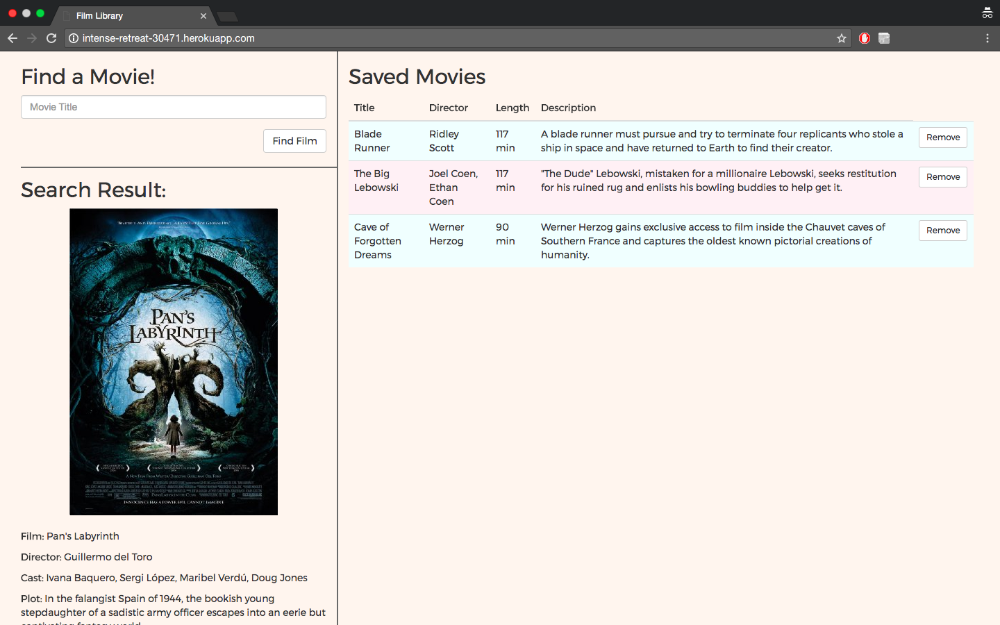

# MEAN Movie Lister

Y Paul Sussman: April 10th, 2017; Version 1.0

## Application Overview
For this, the fifth Prime Weekend Challenge, I worked with AngularJS and the OMDB API to build an application that searches movies, allowing a user to store their favorites.

## Getting Started

Fork, clone, or download the project, then run `npm install`.

In the `movies.js` file, you'll need to replace the `process.env.OMDBAPI` config variable with your own OMDb API key. It's a great service, especially for beginning developers, and I [highly recommend supporting them](https://www.patreon.com/omdb/posts) as you can.

## Built With

* HTML 5, CSS 3, Bootstrap, and AngularJS;
* Node.js, Express.js, and MondgoDB; and
* Heroku and mLab for hosting.

## Learning Value
Ironically, perhaps, for my first for project integrating MongoDB and AngularJS? My first major rabbit hole in this project revolved around Bootstrap and padding inheritance: here is where I truly begin to appreciate the power of the "Styles" pane inside Chrome's developer tools, as well as its "mouseover to inspect element" feature.

One great weakness of this project stems from my unfamiliarity, at the time, with how to manipulate data bindings inside an `ng-repeat`. Rather than exploring these to satisfaction, I met the project deadline by using the more-restrictive search parameter that OMDb offers (title, rather than search keyword.)

As a result, the search feature only displays exact title matches: "_Big Trouble Little China_" returns nothing, for example, because of that missing "_in_." (It's no coincidence that my immediately-following projects, the [Karen-English Picture Dictionary](https://github.com/ypaulsussman/karen_english_picture_dictionary) and the [AchieveMpls Coaching Experience](https://github.com/AchieveMpls/achieve-mpls-app), are both stacked to the ceiling with `ng-repeat`'s...!)

Finally, several weeks after I had completed the project, OMDb (_very reasonably_) cancelled their support for API calls lacking a key. One Patreon pledge later, I had the key: but it took me the better part of a Saturday afternoon to deduce how to use it.

From a false turn using a separate, `gitignore`'d config file (_Heroku was not impressed_) to blithely attempting to run environmental variables on the client, it was a... protracted experience. Still, it was one of the first times in my career as a developer where I had, with no support, taught myself several new technologies in order to solve a problem I had not even been able to elucidate at the beginning of the day. That was very rewarding: and, in all likelihood, a process I'll need to get used to.
